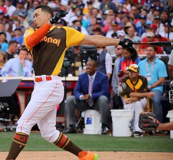

# DataScience_Projects

Here are some guided projects from [Datacamp](https://www.datacamp.com/home) Data Science Path.

### 1. [Exploring the Bitcoin cryptocurrency market](./1_Bitcoin_Cryptocurrency_Market/1_Bitcoin_Cryptocurrency_Market.ipynb)

### 2. [Risk and Returns: The Sharpe Ratio](./2_The_Sharpe_Ratio)

### 3. [A new era of Data Analysis in Baseball](./3.Data_Analysis_Baseball)

{ width=50% } { width=50% }
